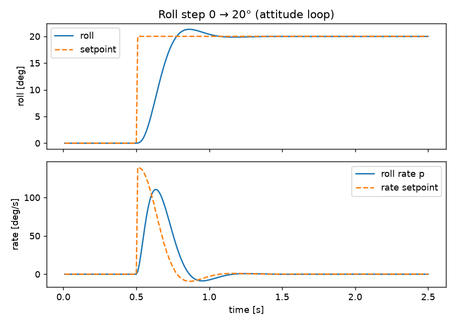
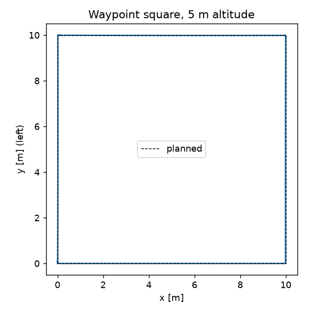
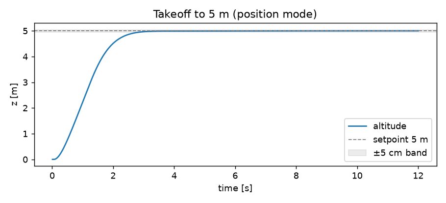
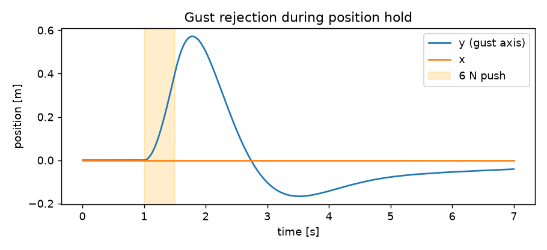
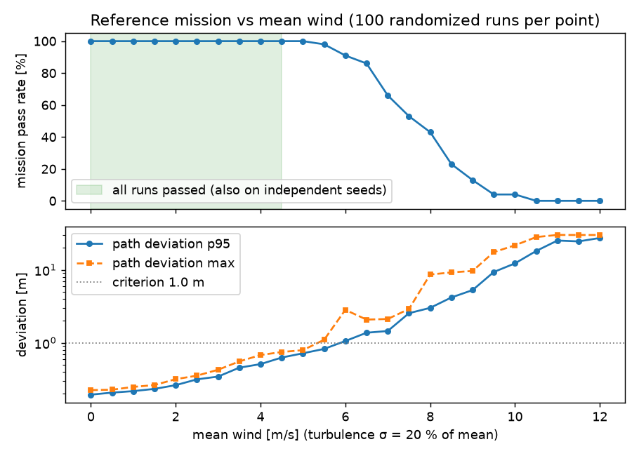
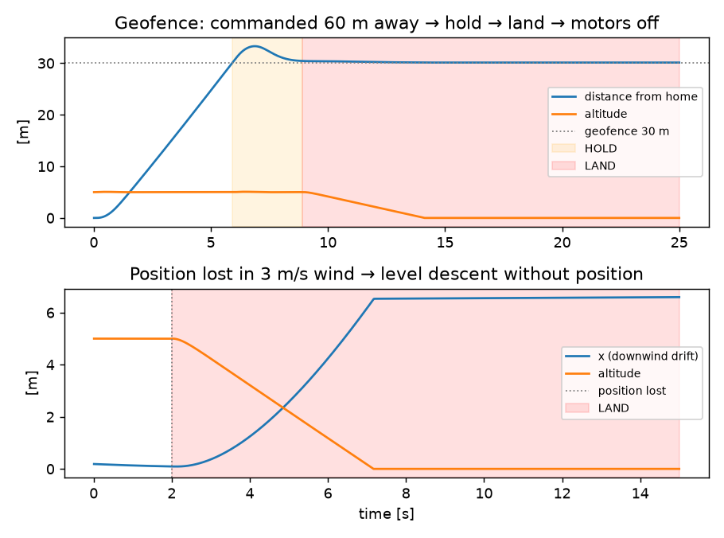

# UE5 Drone Simulator

쿼드로터의 6자유도 동역학과 캐스케이드 비행제어를 엔진과 분리된 C++ 코어(**FlightCore**)로 구현하고,
Unreal Engine 5는 시각화·조종·HUD만 맡도록 만든 드론 비행 시뮬레이터입니다.
제어 성능은 엔진 없이 돌아가는 헤드리스 시나리오 테스트로 **수치 검증**하고, 같은 코어로 비행 전에
조건을 무작위로 바꿔 가며 수백 번 가상 비행해 **어디까지 안전한지(운용 한계)** 를 먼저 확인합니다.

```
Source/Drone_Simulater/
  FlightCore/            엔진 비의존 헤더 (UE와 테스트가 같은 파일을 컴파일)
    FcMath.h             Vec3 / Quaternion, UE 좌표계(왼손) 변환
    Quadrotor.h          6-DOF 강체 + 모터 4개 모델 (모터별 효율: 편차·고장 주입용)
    Controller.h         위치 → 속도 → 자세 → 각속도 → 믹서
    Safety.h             런타임 안전 모니터 (hold → land → 모터 정지)
    Mission.h            헤드리스 비행 하네스, 외란·센서 고장 모델, 기준 임무와 통과 기준
  DroneActor.*           UE Pawn: 1 kHz 고정 스텝으로 FlightCore 구동, 입력·HUD·충돌·비행 로그·사전검증
Tools/FlightSim/
  sim_main.cpp           단위 검사 + 비행 시나리오 + 고장 주입 + 몬테카를로 시험, 통과 기준 assert
  plot.py                CSV → docs/img/*.png
```

## 모델

| 구성 | 내용 |
|---|---|
| 기체 | 1.5 kg, X형 450급(암 0.225 m), 관성 Ixx=Iyy=0.0213, Izz=0.0395 kg·m² |
| 모터 | 추력 T = kT·ω², 반토크 Q = kQ·ω², 1차 지연(τ = 30 ms), ω ≤ 1100 rad/s (추력/중량 ≈ 3.3) |
| 강체 | 오일러 회전방정식 I·ω̇ = τ − ω×Iω, 쿼터니언 자세 적분, 1 kHz semi-implicit Euler |
| 공력 | 상대풍 기준 선형+2차 항력, 각속도 감쇠 |
| 환경 | 정상풍 + 1차 Gauss-Markov 난류, 외란력(돌풍), 지면(z=0) 접촉. UE에서는 스윕 충돌로 레벨 지형과 상호작용 |
| 센서 | 자이로·위치·속도 가우시안 노이즈, 자이로 바이어스, 위치(GPS) 두절 |

## 제어기 (250 Hz)

```
위치 오차 ─P→ 속도 설정 ─PI→ 목표 가속도 → 추력 벡터(최대 기울기 35° 제한) + 요 → 목표 자세(쿼터니언)
목표 자세 ─쿼터니언 오차 P→ 각속도 설정 ─PID(측정값 미분) + 자이로 피드포워드→ 토크
총추력 + 토크 ─믹서(기하 역행렬)→ 모터별 ω 명령   ※ 모터 포화·기울기 제한 시 적분 정지(anti-windup)
```

- **Angle 모드**(기본): 스틱 = 기울기 각 / 요 속도 / 상승률. 스틱을 놓으면 수평·고도 유지.
- **Position 모드**(Hover 키): 현재 위치 고정, 웨이포인트 비행.
- 기울기 제한에 걸리면 적분항(바람 등 정상 외란 보상)에 기울기를 먼저 배분하고 남은 만큼을 비례항에 준다(v3).

## 검증 결과

`Tools/FlightSim`에서 빌드·실행하면 40개 검사가 통과/실패로 출력되고, 실패가 있으면 종료 코드 1을 반환합니다.
통과 기준은 결과를 보기 전에 정했습니다(예외 하나는 아래 v3 기록에 적었습니다). 시드를 고정해 결과가 매번 같습니다.

| 시나리오 | 지표 | 결과 | 기준 |
|---|---|---|---|
| 단위 검사 | 믹서 역변환 오차, 오일러 왕복, 부호 규약, UE 좌표 변환 일관성 | 1e-9 이하 | 통과 |
| 1. 지면 이륙 → 5 m | 90% 도달 / 오버슈트 / 정착(±5 cm) | 1.99 s / 0.00 m / 2.86 s | < 4 s / < 0.25 m / < 7 s |
| 2. 롤 0 → 20° 계단 | 상승시간 / 오버슈트 / 정착(±1°) | 0.24 s / 1.3° / 0.42 s | < 0.4 s / < 3° / < 1 s |
| 3. 6 N 측면 돌풍 0.5 s | 최대 이탈 / 복귀(< 10 cm) | 0.57 m / 3.56 s | < 0.8 m / < 4 s |
| 4. 5 m/s 정상 측풍 | 정상상태 위치 오차 / 기울기 | 0.005 m / 9.6° | < 0.05 m / > 1° |
| 5. 10 m 정사각 웨이포인트 | 전 구간 도달 / 최장 구간 / 최대 고도 오차 | 4/4 / 3.14 s / 0.05 m | 4/4 / < 8 s / < 0.3 m |
| 6. 센서 노이즈 | 호버 위치 RMS / 최대 기울기 떨림 | 0.004 m / 0.5° | < 0.1 m / < 5° |
| 7. 고장 주입 | 아래 "안전 모니터와 고장 주입" 참고 | 15개 통과 | |
| 8–9. 가상 비행시험 | 아래 "가상 비행시험" 참고 | 4개 통과 | |

| | |
|---|---|
|  |  |
|  |  |

```bash
cd Tools/FlightSim
c++ -std=c++17 -O2 -I ../../Source/Drone_Simulater sim_main.cpp -o flightsim   # 또는 python -m ziglang c++ ...
./flightsim out && python plot.py out ../../docs/img                            # 전체 약 30 s
```

## 가상 비행시험: 비행 전에 운용 한계를 먼저 확인

한 번 잘 나는 것을 보여 주는 것과, 어떤 조건까지 믿고 띄울 수 있는지 말하는 것은 다른 문제다.
기준 임무(고도 5 m, 10 m 정사각형 4구간)를 조건을 무작위로 바꿔 수백 번 헤드리스로 비행시키고,
통과율이 떨어지기 시작하는 지점을 찾았다.

**임무 통과 기준(실행 전 고정):** 모든 웨이포인트 도달(0.5 m, 0.5 m/s 이내) · 구간당 15 s 이내 ·
계획 경로(직선 구간)에서 1.0 m 이내 · 고도 오차 0.5 m 이내 · 안전 모니터 미작동.

**비행마다 무작위로 바꾼 것.** 제어기는 이 값을 모르고 공칭값으로 제어한다. 범위는 측정값이 아니라 가정이다.

| 항목 | 범위 |
|---|---|
| 평균풍 방향 | 0–360° |
| 난류 | 축별 1차 Gauss-Markov, σ = 평균풍의 20 %, 상관시간 2 s |
| 질량 / 관성 / 모터 시정수 | ±10 % / ±15 % / ±20 % |
| 모터별 추력 효율 | ±5 % (개체 편차) |
| 센서 노이즈 (1σ) | 자이로 0–0.03 rad/s, 위치 0–5 cm, 속도 0–0.1 m/s |

**설계점 내 캠페인 (시나리오 8):** 평균풍 0–5 m/s에서 200회 모두 통과했고 안전 모니터 오작동은 0회였다.
경로 이탈은 p50 0.23 m, p95 0.56 m, 최대 0.90 m이고, 고도 오차는 최대 0.21 m였다.

**평균풍 스윕 (시나리오 9):** 0.5 m/s 간격으로 점마다 100회 비행했다. 경계 부근은 다른 시드로 200회 더 비행했다.

| 평균풍 | 통과 (스윕 100회) | 통과 (독립 시드 200회) | 경로 이탈 최대 | 비고 |
|---|---|---|---|---|
| 0–4.0 m/s | 100 % | | ≤ 0.68 m | |
| **4.5 m/s** | **100/100** | **200/200** | 0.89 m | 300회 무실패 → 실패율 < 1 % (95 % 신뢰) |
| 5.0 m/s | 100/100 | 198/200 | 1.10 m | 실패가 나타나기 시작 |
| 5.5 m/s | 98/100 | 193/200 | 1.39 m | |
| 6.0 / 7.0 / 8.0 m/s | 91 / 66 / 43 | | 2.8 / 2.1 / 8.6 m | 경로 추종 실패 |
| 10.5–12 m/s | 0 | | ~30 m | 바람에 밀려 지오펜스 → 안전 모니터가 hold/land |

**결론: 이 모델과 위 가정에서 기준 임무는 평균풍 4.5 m/s까지 안전하다.** 5 m/s부터 실패가 드물게(약 1 %)
나타나고, 7 m/s에서는 세 번 중 한 번꼴로 실패한다. 실패 원인은 대부분 경로 이탈이다. 기울기 한계(35°) 때문에
바람을 버티면서 동시에 가속할 여유가 부족해진다. 기울기는 모든 풍속에서 최대 39–41°였는데, 35° 제한을 넘은
만큼은 자세 루프의 오버슈트다.



## 안전 모니터와 고장 주입

`Safety.h`는 제어기 내부 상태를 보지 않는다. 센서가 보고하는 값, 위치 유효 플래그, 믹서 포화 플래그만 읽고,
이상이 감지되면 제어기의 모드와 설정값을 덮어쓴다. 단계는 올라가기만 한다(hold → land → 모터 정지).

| 조건 | 조치 |
|---|---|
| 기울기 > 45° (제어기 제한 35°) / 지오펜스 이탈 / 천장 초과 / 고도 하한 미만(한 번 넘은 뒤) / 모터 포화 1 s 연속 | HOLD: 그 자리 위치 고정, 3 s 후 LAND |
| 위치 신호 두절 | 즉시 LAND. 위치 고정이 불가능하므로 수평 자세로 상승률 루프만 써서 1 m/s 하강 |
| LAND 중 수직 속도 < 0.1 m/s가 1 s 지속 | 착지로 보고 모터 정지 |
| 기울기 > 70°가 0.3 s 지속 (제어 상실) | TERMINATE: 즉시 모터 정지 |

| 고장 (시나리오 7) | 결과 | 기준 |
|---|---|---|
| a. 모터 1 효율 70 %로 저하 | 모니터 미작동, 최대 이탈 0.38 m, 9 s 후 0.03 m | 미작동 / < 0.5 m / < 0.05 m |
| b. 모터 1 완전 고장 (20 m 호버) | 0.26 s 후 첫 감지, 제어 상실로 TERMINATE (모터 정지 시 고도 18.7 m) | TERMINATE / < 1 s |
| c. 위치 두절, 3 m/s 바람 | 0.008 s 후 LAND, 착지 속도 1.01 m/s, 6.2 s 후 모터 정지, 바람에 6.6 m 밀림 | < 0.1 s / < 1.5 m/s / < 10 s |
| d. 지오펜스 30 m, 60 m 지점 명령 | 5.9 s에 HOLD, 경계 밖 최대 3.3 m, 착지 1.01 m/s, 모터 정지 | < 5 m / < 1.5 m/s |
| e. 자이로 바이어스 2.9°/s (3축) | 모니터 미작동, 위치 RMS 0.001 m | 미작동 / < 0.1 m |
| f. 비행 중 화물 인양 (질량 ×3.2, 추력/중량 1.03) | 1.38 s 후 고도 하한으로 HOLD | < 3 s |

솔직하게 적어 두면:
- (b) 모터 하나를 잃은 쿼드를 이 제어기로는 살릴 수 없다(모터 3개 비행 전략 없음). 모니터는 이를 빨리 판단해
  모터를 끊을 뿐이고, 실기체라면 이 시점이 낙하산을 전개하는 시점이 된다.
- (c) 위치가 없으면 수평을 유지한 채 내려오므로 바람에 떠밀린다. 3 m/s 바람에서 6.6 m 밀렸다.
- (e) 이 모델은 자세를 참값으로 받기 때문에(추정기 없음) 자이로 바이어스가 각속도 루프에만 들어가 영향이 작다.
  자이로를 적분해 자세를 추정하는 실제 시스템에서는 훨씬 위험하다. 이 결과는 위험을 과소평가한다.



## 개발 기록

**v1 (2026.05–06)** — UE 물리(Chaos)에 힘·토크를 직접 넣는 방식. 스로틀이 곧 상승력이고 PID는 자세 각 한 단.
UE5.7에서 로컬 토크 인자가 사라져 조작 축이 틀어지는 문제를, 기체 전방·우측 벡터로 토크를 계산해 해결.
한계: 모터·추력 개념이 없어 조종 게임에 가까웠고, 제어 성능을 수치로 확인할 방법이 없었다.

**v2 (2026.09)** — 동역학·제어를 엔진 밖으로 분리.
- 엔진 없이 테스트할 수 있어야 제어 성능을 숫자로 말할 수 있다고 판단했다. UE는 FlightCore 상태를 그리기만 한다.
- UE는 왼손 좌표계라 경계에서만 y축 거울 변환을 한다. 회전축은 의사벡터라 q → (w, −x, y, −z).
  "우손 요 −90° = UE 요 +90°(+Y를 향함)"를 단위 검사로 고정했다.
- **첫 실행에서 측풍 시나리오가 실패했다(정상상태 오차 0.156 m).** 5 m/s 바람의 항력은 약 1.7 m/s²인데
  속도 적분기 한계(Ki × 한계 = 1.2 m/s²)가 이보다 작아 포화됐다. 한계를 4.8 m/s²로 올렸지만
  오차가 0.056 m로 느리게 수렴해(시정수 약 6 s) 수평 Ki를 스윕했다.

  | 수평 Ki | 측풍 오차 | 돌풍 복귀 | 웨이포인트 최장 구간 |
  |---|---|---|---|
  | 0.4 | 0.056 m (실패) | — | 3.2 s |
  | 0.8 | 0.005 m | 3.56 s | 4.05 s |
  | 1.5 | 0.000 m | 3.24 s | 4.14 s |

  외란 제거와 기동 응답이 트레이드오프라 기준을 만족하는 가장 작은 값 0.8을 채택했다.

**v3 (2026.09)** — 비행 전 가상 검증: 몬테카를로 비행시험, 고장 주입, 안전 모니터.
- 시나리오 하나가 통과한다고 해서 "안전하다"고 말할 수는 없다. 그래서 조건을 흔들어 수백 번 비행하고,
  통과율이 무너지는 지점을 찾는 쪽으로 검증 방식을 바꿨다.
- **첫 실행에서 3개 검사가 실패했다.** 캠페인 197/200, 운용 한계 4 m/s(기준 ≥ 5 m/s), 화물 시나리오.
  - 경로 이탈이 어디서 나는지 분리해 보니 무풍에서도 구간 끝 오버슈트가 0.68 m였다. 원인은 anti-windup의 빈틈이었다.
    적분 정지 조건이 모터 포화뿐이라, 매 구간 가속 중 기울기 제한(35°)에 걸려 있는 동안 속도 적분기가 계속 쌓였다가
    도착 지점에서 오버슈트로 풀렸다. v2의 "모서리 0.5 m 오버슈트"도 대부분 이것이었다.
    기울기 제한도 적분 정지 조건에 넣자 무풍 오버슈트는 0.68 → 0.17 m, 5 m/s에서는 1.66 → 0.29 m로 줄었다.
  - 남은 실패는 측풍 속 가속 구간의 측면 이탈이었다. 기울기 제한 시 수평 힘 전체를 같은 비율로 줄이면
    바람을 버티던 몫까지 줄어든다. 적분항(정상 외란 보상)에 기울기를 먼저 배분하도록 바꿔
    6 m/s 통과율이 33/40에서 39/40으로 올랐다.
  - 화물 시나리오 실패는 모니터가 아니라 시험 하네스의 버그였다. 질량을 호버 안정화 단계 전에 바꿨는데, 그 단계는
    모니터가 꺼진 상태라 기체가 이미 추락해 있었다. 고장을 비행 중(t = 1 s)에 주입하도록 고치자 1.38 s 후 감지됐다.
- **운용 한계 5 m/s 주장을 철회했다.** 수정 후 40회 스윕은 5 m/s를 전부 통과했지만, 독립 시드 200회에서는
  198/200이었다. 한 번의 스윕은 운이 좋을 수 있다. 그래서 스윕을 0.5 m/s 간격 100회로 촘촘히 하고
  경계에서 독립 시드 200회로 재확인하도록 바꿨고, 결론을 4.5 m/s로 낮췄다.
  원래 기준(≥ 5 m/s)은 "4.5 m/s 이상 유지" 회귀 방지 검사로 바꿨다. 결과를 본 뒤 정한 유일한 기준이라 여기에 적어 둔다.
- 기존 21개 검사의 결과는 v3 변경 후에도 시나리오 5 외에는 소수점까지 같았다(시나리오 5 최장 구간 4.05 → 3.14 s,
  총 임무 시간 16.2 → 12.5 s). v2 문서에는 검사 수를 22개로 잘못 적었는데, 실제로는 21개였다.

## 알려진 한계

- **모든 결과는 이 시뮬레이션 모델 안에서의 결과다.** 파라미터는 450급 기체의 전형값이며
  실기체로 식별(system identification)한 값이 아니다. 무작위화 범위와 난류 강도도 가정이다.
  운용 한계 4.5 m/s는 "이 모델에서"의 수치이며, 실기체에 쓰려면 식별된 파라미터로 다시 돌려야 한다.
- 난류는 축별 1차 Gauss-Markov 과정으로, Dryden 스펙트럼 모델이 아니다. 지면 효과, 블레이드 플래핑, 배터리 전압 강하는 없다.
- 상태 추정기 없음: 제어기는 노이즈가 섞인 참값을 직접 받는다(EKF 미구현). 그래서 자이로 바이어스 같은 고장의 영향을 과소평가한다.
- 모터 하나를 완전히 잃으면 회복 전략이 없다. 모니터는 모터를 정지할 뿐이다.
- 경로는 웨이포인트를 향한 위치 P 제어이며, 속도 피드포워드나 궤적 계획은 없다. 무풍 오버슈트는 약 0.2 m다.
- 자세 루프가 기울기 설정값(35°)을 4–6° 넘긴다(최대 40.7°). 모니터의 기울기 한계(45°)까지 여유가 약 4°뿐이다.
- 믹서 포화는 모터별 클램프만 한다(요 우선 desaturation 없음).
- 시험 하네스의 호버 안정화 단계(2 s)는 모니터가 꺼져 있다. 고장은 그 이후에 주입해야 한다.
- UE 레이어는 스폰 지점을 지면(z=0)으로 본다. 충돌은 스윕 정지 + 법선 방향 속도 제거만 하고 반발·파손은 없다.
- **v3의 UE 코드(안전 모니터 연동, 사전검증, HUD·로그 추가)는 아직 UE에서 빌드·실행하지 않았다.**
  FlightCore 헤더는 이 저장소의 테스트 도구로 컴파일·검증했지만, DroneActor 변경은 코드 검토만 했다.

## UE에서 실행

UE 5.7, Enhanced Input. `BP_Drone`의 RotorPivot1–4를 모터 1 전좌 · 2 전우 · 3 후우 · 4 후좌 위치에 둔다.
Hover 키 = 위치 고정 토글, `WindMps`로 바람 설정, 종료 시 `Saved/FlightLogs/flight_*.csv`에 50 Hz 비행 로그 저장
(마지막 열 `safety`: 0 정상, 1 HOLD, 2 LAND, 3 TERMINATE).

- **사전검증:** BeginPlay에서 같은 FlightCore로 기준 임무를 `PreflightRuns`회(기본 20) 헤드리스 비행한다.
  조건은 `|WindMps|` 평균풍에 난류·모델 오차·센서 노이즈를 무작위로 더한 것이다. 결과(예: `사전검증 PASS: 기준 임무 20/20 통과`)는
  출력 로그와 `PreflightResult`에 남는다. 조종사가 실제로 날릴 경로가 아니라 기준 임무에 대한 검증이다.
- **안전 모니터:** `bEnableSafetyMonitor`, `GeofenceRadiusM`(100 m), `CeilingM`(50 m). 한 번 작동하면
  세션이 끝날 때까지 유지된다(재시작 필요). 작동 중에는 Hover 키가 무시된다. UE에는 GPS 모델이 없어 위치는 항상 유효로 본다.
- HUD 위젯에 `Text_Safety` TextBlock을 추가하면 사전검증 결과와 모니터 상태가 표시된다. 없으면 표시만 생략된다.
